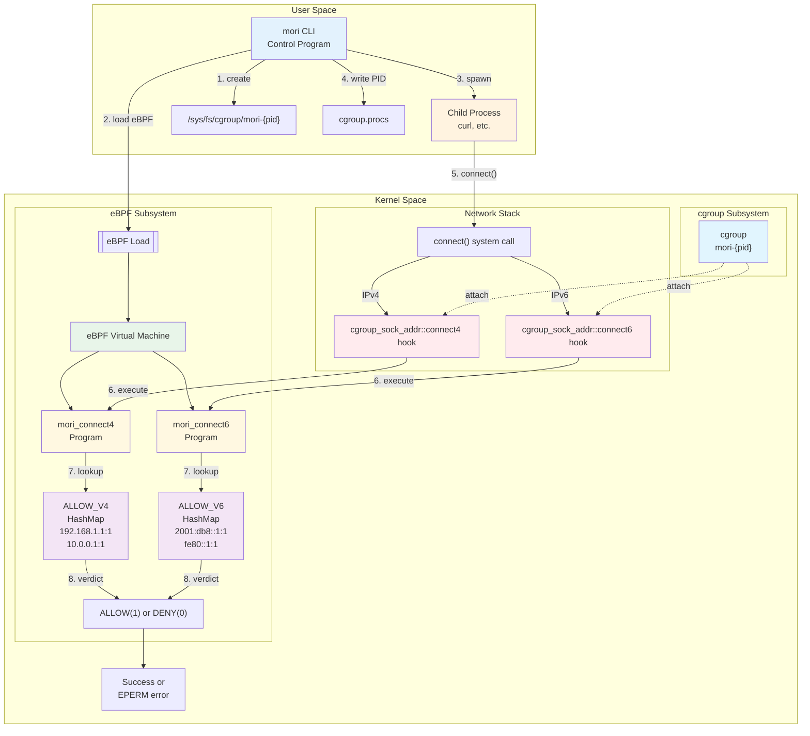

# cgroup, eBPF, and mori_connect4/6 Architecture

This document explains how mori leverages cgroup and eBPF to achieve network control.

## Architecture Overview (Mermaid Diagram)



## Operation Flow

### 1. cgroup Creation and Management
- mori creates `/sys/fs/cgroup/mori-{pid}` directory
- This cgroup becomes the process group boundary

### 2. eBPF Program Attachment
- Attach `mori_connect4/6` to the cgroup
- **Important**: By attaching to a cgroup, the rules apply only to processes within that cgroup
- No impact on other processes (ensures isolation)

### 3. Hook Points
- eBPF programs of type `cgroup_sock_addr`
- Operate at `connect4`/`connect6` hook points
- Automatically triggered when a process in the cgroup calls `connect()`

### 4. Control Mechanism
```
Process → Check cgroup membership → Execute cgroup's eBPF program → Allow/Deny
```

### 5. BPF Map Roles
- `ALLOW_V4`/`ALLOW_V6`: Allowed IP lists
- Updatable from user space
- Fast lookup in kernel space (O(1) hash map)

## Key Concepts

### Role of cgroup
```
  cgroup (Control Group)
      ↓
  ┌───────────────────────────┐
  │ Process Grouping          │ ← Child processes auto-inherit
  │ eBPF Attachment Point     │ ← Hooks are installed here
  │ Isolation Boundary        │ ← No impact on other processes
  └───────────────────────────┘
```

### Data Flow
```
  Child Process → cgroup Check → eBPF Execute → Map Lookup → Allow/Deny
       ①              ②              ③             ④            ⑤
```

### Control Scope
```
  ┌─────────────┐        ┌─────────────┐
  │ Inside      │        │ Outside     │
  │ cgroup      │        │ cgroup      │
  │ ┌─────────┐ │        │ ┌─────────┐ │
  │ │Process A│ │←control│ │Process X│ │←no control
  │ │Process B│ │←control│ │Process Y│ │←no control
  │ └─────────┘ │        │ └─────────┘ │
  └─────────────┘        └─────────────┘
```

## Why cgroup is Necessary?

1. **Process Isolation**: Apply restrictions only to specific process groups
2. **Hierarchical Management**: Child processes automatically inherit the same restrictions
3. **eBPF Attachment Point**: cgroup provides the location to attach eBPF programs
4. **Resource Management**: Can add CPU/memory limits in the future

## Implementation Details

### CgroupManager (src/runtime/linux.rs)
- Creates and manages `/sys/fs/cgroup/mori-{pid}` directory
- Moves processes by writing PID to `cgroup.procs`
- Automatically removes cgroup directory on Drop

### NetworkEbpf (src/runtime/linux.rs)
- Loads eBPF ELF binary and registers with kernel
- Attaches `mori_connect4`/`mori_connect6` programs to cgroup
- Adds IP addresses to `ALLOW_V4`/`ALLOW_V6` maps

### eBPF Programs (mori-bpf/src/main.rs)
- `mori_connect4`: Hook processing for IPv4 connections
- `mori_connect6`: Hook processing for IPv6 connections
- Currently allows all connections (test implementation)

## Future Implementation Plans

1. **Actual IP Matching Logic**: Move from current test implementation to real allow/deny decisions
2. **FQDN Support**: Name resolution with Hickory DNS and TTL respect
3. **Port Control**: Control by port numbers in addition to IP addresses
4. **Logging**: Recording and visualization of denial events
