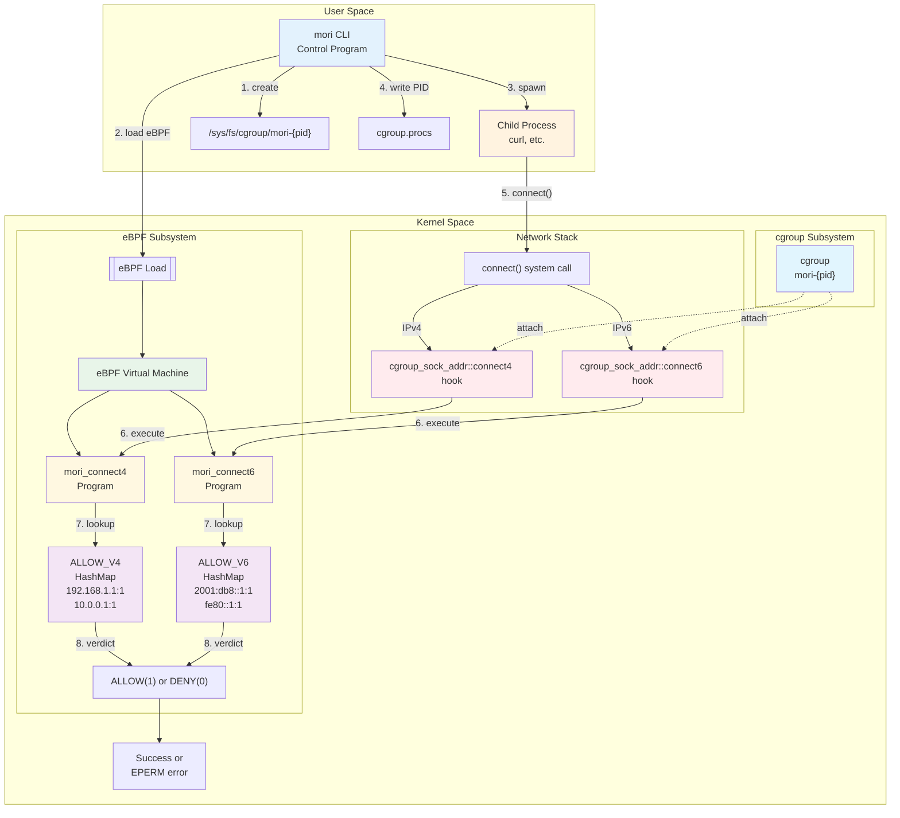

# cgroup, eBPF, and mori_connect4/6 Architecture

This document explains how mori leverages cgroup and eBPF to achieve network control.

## Architecture Overview (Mermaid Diagram)



## Operation Flow

### 1. cgroup Creation and Management
- mori creates `/sys/fs/cgroup/mori-{pid}` directory
- This cgroup becomes the process group boundary

### 2. eBPF Program Attachment
- Attach `mori_connect4/6` to the cgroup
- **Important**: By attaching to a cgroup, the rules apply only to processes within that cgroup
- No impact on other processes (ensures isolation)

### 3. Hook Points
- eBPF programs of type `cgroup_sock_addr`
- Operate at `connect4`/`connect6` hook points
- Automatically triggered when a process in the cgroup calls `connect()`

### 4. Control Mechanism
```
Process → Check cgroup membership → Execute cgroup's eBPF program → Allow/Deny
```

### 5. BPF Map Roles
- `ALLOW_V4`/`ALLOW_V6`: Allowed IP lists
- Updatable from user space
- Fast lookup in kernel space (O(1) hash map)

## Key Concepts

### Role of cgroup
```
  cgroup (Control Group)
      ↓
  ┌───────────────────────────┐
  │ Process Grouping          │ ← Child processes auto-inherit
  │ eBPF Attachment Point     │ ← Hooks are installed here
  │ Isolation Boundary        │ ← No impact on other processes
  └───────────────────────────┘
```

### Data Flow
```
  Child Process → cgroup Check → eBPF Execute → Map Lookup → Allow/Deny
       ①              ②              ③             ④            ⑤
```

### Control Scope
```
  ┌─────────────┐        ┌─────────────┐
  │ Inside      │        │ Outside     │
  │ cgroup      │        │ cgroup      │
  │ ┌─────────┐ │        │ ┌─────────┐ │
  │ │Process A│ │←control│ │Process X│ │←no control
  │ │Process B│ │←control│ │Process Y│ │←no control
  │ └─────────┘ │        │ └─────────┘ │
  └─────────────┘        └─────────────┘
```

## Why cgroup is Necessary?

1. **Process Isolation**: Apply restrictions only to specific process groups
2. **Hierarchical Management**: Child processes automatically inherit the same restrictions
3. **eBPF Attachment Point**: cgroup provides the location to attach eBPF programs
4. **Resource Management**: Can add CPU/memory limits in the future

## Implementation Details

### CgroupManager (src/runtime/linux/cgroup.rs)
- Creates and manages `/sys/fs/cgroup/mori-{pid}` directory
- Moves processes by writing PID to `cgroup.procs`
- Automatically removes cgroup directory on Drop

### NetworkEbpf (src/runtime/linux/ebpf.rs)
- Loads eBPF ELF binary and registers with kernel
- Attaches `mori_connect4` program to cgroup
- Provides methods to add/remove IPv4 addresses from ALLOW_V4 map

### eBPF Programs (mori-bpf/src/main.rs)
- `mori_connect4`: Hook processing for IPv4 connections
  - Extracts destination IPv4 address from socket context
  - Looks up address in ALLOW_V4 HashMap
  - Returns `1` (allow) if found, `0` (deny) otherwise
- `mori_connect6`: Placeholder for IPv6 (not yet implemented)

### DNS Resolution and Refresh (src/runtime/linux/refresh.rs)
**Initial Resolution:**
1. Parse NetworkPolicy to extract domains
2. Use Hickory Resolver (tokio-based) to resolve domains → IPv4 addresses
3. Store results in DnsCache with TTL information
4. Add resolved IPs to eBPF ALLOW_V4 map
5. Also add DNS server IPs to allow list (for DNS queries to work)

**Periodic Refresh (tokio task):**
1. Spawn async task if domains are specified
2. Monitor DnsCache for upcoming expirations
3. Sleep until next refresh needed (based on TTL)
4. Re-resolve domains before TTL expires
5. Detect IP changes (added/removed addresses)
6. Update eBPF map accordingly:
   - Add new IPs to ALLOW_V4
   - Remove old IPs from ALLOW_V4
7. Handle DNS failures gracefully (log and continue)
8. Terminate on shutdown signal

**Shutdown Coordination (src/runtime/linux/sync.rs):**
- `ShutdownSignal` uses `tokio::sync::Notify` + `AtomicBool`
- Refresh task races between:
  - DNS refresh timeout (`tokio::time::sleep`)
  - Shutdown notification (`notify.notified()`)
- Main process sends shutdown signal when child terminates
- Refresh task exits cleanly via `tokio::task::JoinHandle::await`

## Implementation Status

### ✅ Implemented
1. **IP Matching Logic**: IPv4 address-based allow/deny decisions
2. **FQDN Support**: Async DNS resolution with Hickory DNS and TTL-based auto-refresh
3. **DNS Cache Management**: TTL tracking and automatic re-resolution
4. **Dynamic eBPF Map Updates**: Real-time updates as DNS records change
5. **Shutdown Signaling**: Clean termination of DNS refresh tasks using tokio primitives

### 🚧 Future Plans
1. **IPv6 Support**: `connect6` hook and ALLOW_V6 map
2. **Port Control**: Port number-based filtering
3. **CIDR Support**: IP range specification (e.g., `192.168.1.0/24`)
4. **Logging**: Recording and visualization of denial events
5. **UDP/QUIC**: Support for non-TCP protocols
