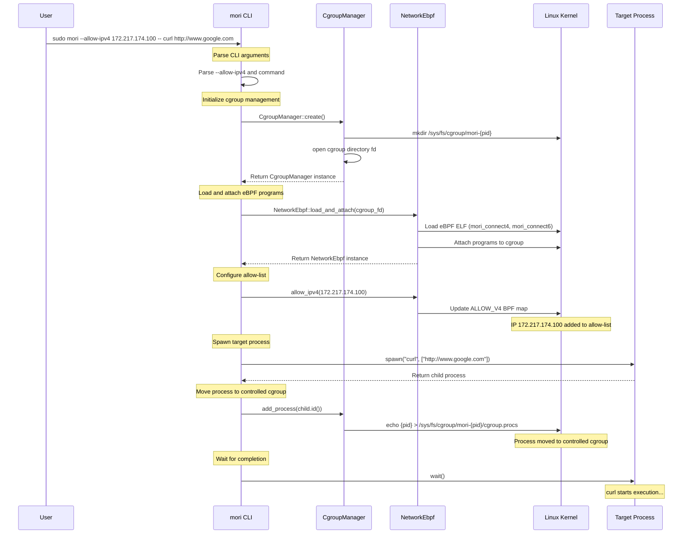
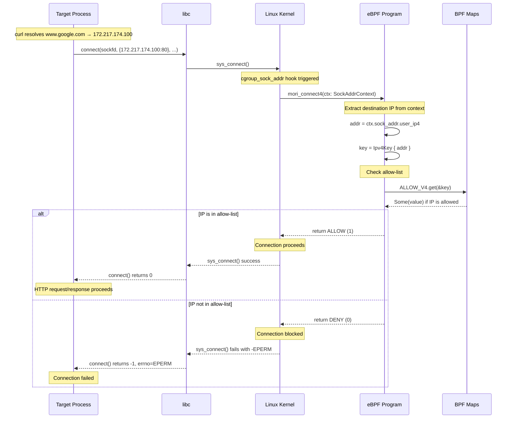
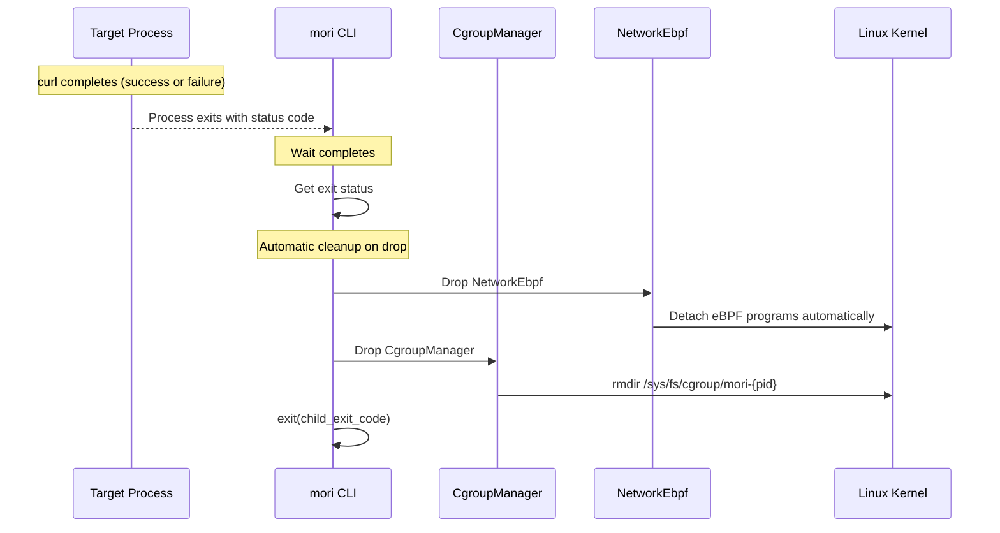

# Mori シーケンス図

このドキュメントでは、moriの実行フローとネットワーク接続制御の処理フローをシーケンス図で説明します。

## 1. Mori実行開始時の処理フロー

## 2. ネットワーク接続時の制御フロー

## 3. プロセス終了と cleanup

## コンポーネント説明

### mori CLI
- コマンドライン引数の解析
- cgroup管理とeBPFプログラムの初期化
- 子プロセスの実行と監視

### CgroupManager
- 一意なcgroupディレクトリの作成 (`/sys/fs/cgroup/mori-{pid}`)
- プロセスのcgroupへの移動
- 自動cleanup（Drop時にcgroupディレクトリ削除）

### NetworkEbpf
- eBPFプログラムのロードとアタッチ
- IP許可リスト（BPFマップ）の管理
- 自動cleanup（Drop時にプログラムのデタッチ）

### eBPF Program (mori_connect4/mori_connect6)
- `connect()` システムコール時に呼び出される
- 接続先IPアドレスを許可リストと照合
- 許可/拒否の判定を返す

### BPF Maps (ALLOW_V4/ALLOW_V6)
- IPv4/IPv6アドレスの許可リストを格納
- ユーザー空間から更新可能
- eBPFプログラムから高速参照可能

## 実装のポイント

1. **非同期処理**: eBPFプログラムはカーネル空間で実行され、パフォーマンスへの影響を最小化
2. **自動cleanup**: Rustのドロップ機構により、リソースの確実な解放を保証
3. **プロセス分離**: cgroupによりターゲットプロセスを分離し、他のプロセスに影響しない
4. **高速な許可判定**: BPFマップによる O(1) の許可判定